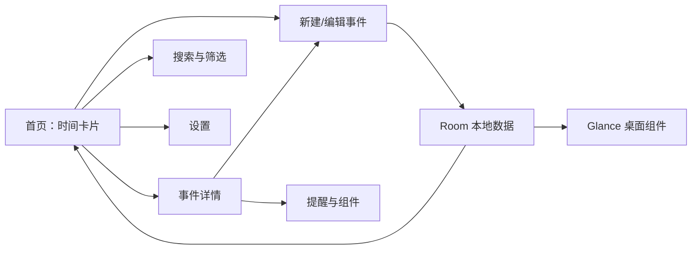

# Android 时间事件 App：Vibe Coding 设计方案

> 当前产品名：**Moment Mark / 刻间**
> 一句话定位：把重要事件变成始终可见的“时间卡片”——未来还有多久，过去已经多久。

> 文档状态：**2026-08-19 已与当前 Android 雏形同步**  
> 当前里程碑：**阶段 7B 质量加固；首页自适应背景融合层已加入，仍待真机视觉验证**  
> 事实口径：只有源码中已存在且本轮实际验证过的内容才标记为“已验证”；编译成功不等于真机交互、持久化、无障碍或时间边界已经验证。

## 0. 当前进度与状态口径

### 0.1 状态标签

后续文档和任务统一使用以下标签，避免把规划、占位和可发布能力混在一起：

- **已实现 · 已构建验证**：源码存在，且本轮命令行构建或静态检查已通过。
- **已实现 · 待真机验证**：源码存在，但手势、视觉、性能、系统行为仍需模拟器或真机确认。
- **原型态**：可用于验证设计方向，但数据、错误处理、持久化或边界条件尚未达到发布标准。
- **规划中**：尚未实现；界面不得伪装成已可用功能。
- **阻塞发布**：在首个公开版本前必须解决。

### 0.2 阶段 1 同步快照

| 范围 | 当前事实 | 状态 |
|---|---|---|
| 工程骨架 | Kotlin、Jetpack Compose、Material 3、单 Activity，`minSdk 26`、`targetSdk 36` | 已实现 · 已构建验证 |
| 首页 | 可折叠沉浸式 Hero 背景/文案、自适应环境过渡层、纸张卡片外框、上下长扁圆角时间轴导航、两列网格、Small 单格/Wide 跨两列 | 已实现 · 待真机验证 |
| 卡片体系 | 经典三段式蓝白/橙白卡；奶油极简、黄昏玻璃、旅行手账三种旅行模板 | 原型态 |
| 模板配置 | 标题、标签、分组、目标日期、顶部图标、Small/Wide 可在事件设置页实时预览 | 原型态；只保存在内存 |
| 分类 | 抽屉中的全部、未来、过去、置顶可筛选内存样例；真实分组未接入 | 原型态 |
| 主题 | 设置页提供跟随系统 / 浅色 / 深色三态；页面与通用容器使用语义化 Material 3 token，本阶段不持久化 | 原型态；待真机验证 |
| 时间 | `EventTimeCalculator` 统一处理 `ALL_DAY` / `TIMED`，共享状态按类型刷新；Clock、ZoneId 可注入并有边界测试 | 已实现 · 已构建验证；待真机验证 |
| 数据 | 使用 `SampleEvents` 假数据；无 Room、Repository、迁移、导入导出 | 规划中 · 阻塞发布 |
| CRUD | 卡片可进入设置并修改内存模板；新增、删除、归档、撤销均未实现 | 规划中 · 阻塞发布 |
| 搜索 | 展开输入框，按当前内存事件标题筛选；支持聚焦、清空、无结果和返回关闭 | 已实现 · 待真机验证 |
| 日子簿 | 月视图、事件横杠、当日详情、可点击空状态；与首页共用胶囊导航，新增页返回来源页 | 原型态 · 已接入 |
| 测试与构建 | 13 个 JUnit 测试通过；Debug APK 生成；lint 为 0 error、9 个版本提示 | 已实现 · 已构建验证 |
| Widget / 通知 | 尚未创建 | 规划中 |

### 0.3 本轮验证基线

- 验证日期：2026-08-19。
- 命令：`JAVA_HOME='/Applications/Android Studio.app/Contents/jbr/Contents/Home' ./gradlew testDebugUnitTest assembleDebug lintDebug`。
- 结果：13 个 JUnit 测试通过（时间计算 10 个 + Hero 折叠进度 3 个），Debug APK 已生成；lint 为 `0 errors, 9 warnings`，均为可升级的 Gradle/AGP/依赖版本提示。
- 本轮 UI 验证边界：只完成源码编译、纯函数测试和静态检查；`adb devices` 未发现可用设备，不能把构建成功表述为真机 UI、60fps 或手势验证。
- 未验证：模拟器/真机启动、手势冲突、不同屏幕、字体缩放、TalkBack、完整深色模式、进程死亡恢复、跨午夜/时区/DST、Room、Widget、通知和发布签名包。

## 1. 产品判断

这不是日历、待办或番茄钟，而是一款低频创建、高频查看的“时间感知工具”。用户只需要建立一个事件，App 自动根据当前时间显示：

- 未来事件：`距离研究生考试还有 128 天`
- 过去事件：`开始健身已经 312 天`
- 到达目标时刻后：同一张卡片自动从“还有”切换为“已经”，不需要重新创建

核心差异化不是堆功能，而是：

1. **正计时和倒计时统一**：一个事件模型、同一张卡片、自然跨过零点。
2. **时间语义可信**：明确区分“全天日期”和“精确时刻”，避免天数、时区、夏令时产生歧义。
3. **本地优先**：首版无需账号、无广告、离线可用，创建后立刻得到价值。
4. **小组件优先设计**：App 是编辑器，桌面组件才是最高频入口。

## 2. 竞品观察（截至 2026-08）

| 产品 | 做得好的地方 | 暴露出的不足 | 值得借鉴 / 避免 |
|---|---|---|---|
| Days Matter · 倒数日 | 正数/倒数、分类、农历、置顶、背景、日期计算器和多种组件，功能覆盖完整 | Google Play 评分约 3.9；评论中出现默认分类不可删除、缺少事件独立时区、组件数据消失等反馈 | 借鉴“卡片 + 分类 + 组件”；不要把历史、计算器等边缘能力塞进 MVP；组件稳定性必须作为核心质量指标 |
| TheDayBefore | 10M+ 下载、4.6 分；计算模式、重复、提醒、装饰、故事、分享和分组都很成熟 | 功能与装饰密度高；有用户反馈未登录无法创建 | 借鉴丰富的后续扩展空间；首版不强制账号，创建流程控制在一个页面 |
| How Long Since | 极简、离线、暗色模式、无限事件、桌面组件；“戒烟/健身/里程碑”等使用语境明确 | 主要聚焦“已经过去多久”，未来事件和组织能力较弱 | 借鉴克制、动机型文案；用统一模型补足未来倒计时 |
| Countdawns | 单位可自由组合，卡片和组件风格现代，可显示总秒数等个性表达 | 高自由度容易增加设置成本；秒级桌面刷新并不适合 Android 后台约束 | 借鉴即时预览与单位选择；组件默认只显示天/小时，不承诺后台秒级跳动 |
| Countdown to Anything（iOS 参考） | 正数/倒数并存、重复事件、分享、组件；完成后可快速转为正计时 | 图标和娱乐化表达较强，不一定适合追求安静效率的用户 | 借鉴“事件过期后的连续性”和组件配置体验 |

市场机会可以概括为：**比纯计数器更完整，比纪念日大全更轻，比装饰型组件更可靠。**

## 3. MVP 功能边界

### 必须实现（v0.1）

- 新建、编辑、删除、归档事件
- 全天事件 / 精确时刻两种类型
- 自动显示“还有多久 / 已经多久”
- 首页卡片列表：全部、未来、过去、置顶
- 搜索、置顶、自定义颜色和图标
- 事件详情：大数字、完整日期、备注、精确时间拆分
- 深色模式、Material 3 动态配色
- 数据只存本地，无需账号
- 2×2 单事件桌面小组件
- 事件创建、修改、删除后立即刷新相关小组件
- 基础单元测试与数据库迁移测试

### v0.2 再实现

- 4×2 单事件组件、4×4 多事件列表组件
- 提前 1 天 / 3 天 / 1 周提醒
- 每年、每月、每周重复
- “计入事件当天”高级规则
- 分享海报、本地导入导出、回收站

### 暂不实现

- 登录、云同步、好友社交、公开广场
- AI 自动生成事件
- 农历、复杂节假日库
- 日记/相册、待办、番茄钟
- 桌面组件每秒更新

暂缓这些能力能避免首版变成一个不好用的“半成品日历”。

## 4. 信息架构与主流程



首版不需要传统的 3～5 个底部导航。建议使用：

- 顶部：分类抽屉入口、产品名、搜索、设置
- 分类选择：只在左侧抽屉中选择 `全部 / 未来 / 过去 / 置顶`
- 中部：时间卡片列表
- 右下角：唯一主操作 `+`

### 新建事件：一个页面完成

页面顶部始终显示实时预览卡片，下面依次为：

1. 事件名称（进入页面后自动聚焦）
2. 日期
3. `全天` 开关；关闭后出现时间和时区
4. 图标与颜色（给出 8 个默认组合，不先做复杂主题编辑器）
5. 备注（可选，默认折叠）
6. 提醒（v0.1 可显示“即将推出”，代码中不要放空实现）
7. 保存

日期在过去还是未来由系统自动判断，不要求用户先选“正计时/倒计时”。这会少一个概念和一次点击。

## 5. 关键页面设计

### 首页

```text
☰  刻间                         搜索  设置

┌──────────────────────────┐
│ ✈  东京旅行                    │
│    还有  24 天                  │
│    2026年9月11日 · 全天         │
└──────────────────────────┘

┌──────────────────────────┐
│ ●  开始学习 Kotlin              │
│    已经  86 天                  │
│    2026年5月24日 20:30          │
└──────────────────────────┘

                         [ ＋ ]
```

设计要点：

- 数字是第一视觉层级，标题第二，原始日期第三。
- 未来事件用较明亮的主题色；过去事件使用沉稳色，但不能只靠颜色区分。
- 卡片只显示一个主单位，详情页再显示 `86天 4小时 32分`。
- 长按进入多选不放在首版；左滑归档、右滑置顶可以在 v0.2 加入。
- 空状态直接给两个示例按钮：`记录一个已经开始的事件`、`期待一个未来事件`。

### 阶段 1 已落地的视觉与功能调整

当前实现已经从最初的单一卡片雏形演进为“经典卡 + 主题模板”的首页体系：

- 顶部“刻间”使用暖白半透明悬浮栏；左侧菜单打开分类抽屉，右侧保留搜索和设置。
- 分类抽屉中的全部、未来、过去、置顶会真实筛选内存数据；“学习与成长 / 旅行与生活”仍只是分组预留。
- 首页固定两列网格：Small 占一格，Wide 跨两列；两种尺寸不是简单等比缩放，而是分别布局。
- 经典卡片为三段式结构：固定高度标题栏、白色时间主体、浅灰日期底栏；未来为蓝白，过去为橙白。
- 旅行模板包含奶油极简编辑式、黄昏玻璃和手账贴纸三种风格，统一由 `TravelCardConfig` 提供标题、标签、分组、目标日期、图标和尺寸。
- 点击整张卡片进入事件设置页，可切换模板并实时修改旅行模板内容；这些变更只存在当前进程内，离开或杀死 App 后不保证保留。
- 底部时间轴导航只聚焦“大事件 / 日子簿”；首页与日子簿共用同一套轻量胶囊导航，大事件回主页，日子簿进入月历页。
- 时间主数字使用内置的“兰亭黑-繁-特黑”字体资源；正式发布前必须确认 App 再分发授权，否则更换为可商用字体或系统字体。

### 本轮首页沉浸式 Hero 与滚动折叠（2026-08-19）

本轮是在既有首页上增加一个纵向切片，不重新设计首页卡片：

- 新增 `ui/home/HomeHero.kt`，提供本地 Hero 场景文案、背景承载、连续折叠进度函数和透明/实体导航栏过渡。
- 首页使用现有 `tokyo_sunset_soft.png` 作为本地风景底图，并准备 4 组文案/色调组合；通过 `rememberSaveable` 在一次首页展示期间固定场景，不会因卡片倒计时刷新或普通重组而随机跳变。后续增加真正的本地图片时，只需扩展场景数据源。
- Hero 高度根据可用高度在 `320.dp..420.dp` 内自适应；状态栏通过 `statusBarsPadding()` 与 `WindowCompat` 处理，导航栏在风景上透明，滚动后连续过渡到原页面 Material surface。
- `LazyVerticalGrid` 仍是唯一滚动容器；其两列、Small/Wide span、`12.dp` 横纵间距、`20.dp` 页面水平边距、底部触控栏和 `EventCardFeature` 调用均保持不变。第一张卡片只通过列表起始占位产生轻微覆盖，未修改任何 Card Component。
- 首页滚动使用 Compose 平台默认 fling；筛选、模板映射和排序结果在滚动帧之间保持稳定。卡片进入视区不再逐项播放入场动画，正常浏览时不挂载仅供长按编辑使用的落位动画、变换层和第二层阴影；背景环境雾合成为一次直接渐变绘制，避免全屏模糊和多层全屏离屏/叠绘。
- 首页卡片只展示整天级倒计时，因此精确时刻事件也按分钟刷新；不为每张可见卡保留每秒无可见变化的刷新循环，详情页若需要秒级展示应采用独立按需状态源。
- 背景、文案和导航栏都由 `collapseProgress = 0..1` 插值；文案比背景更早淡出，背景随后渐隐，向下回滚时反向恢复。该进度映射新增 3 个确定性 JUnit 测试。
- 状态：**已实现 · 待真机验证**。尚未宣称真实设备上的滚动帧率、状态栏图标表现、字体缩放、TalkBack、横屏/平板和边缘手势均已通过。

### 阶段 1 必须收口的原型债务

- 搜索图标已接入可见的内存标题搜索；持久化搜索留到 Room 阶段。
- “规划中”条目已改为不可点击说明；当时的临时新建入口已移除，等待真实 CRUD 阶段。
- 当时的临时新建入口只弹出阶段提示，不符合发布级交互标准；在 CRUD 可用前应明确禁用/隐藏，不能伪装成可创建。
- 主题状态已改为“跟随系统 / 浅色 / 深色”，页面与通用容器改用语义化 token；DataStore 持久化留到阶段 3。
- `MomentMarkApp.kt` 已承载首页、抽屉、设置页和多套卡片模板；下一阶段起按 feature/component 拆分，避免继续扩展单一巨型文件。
- 时间刷新已集中到 `ui/components/EventTimeState.kt` 的共享状态层，模板只消费 `EventTimeCalculator` 的领域结果。
- 已新增确定性 JUnit 时间边界测试；它们证明领域计算，不替代 UI、真机、TalkBack 或持久化验证。

### 事件详情

- 顶部沉浸式主题色/渐变背景
- 大标题：`已经 86 天`
- 次级精度：`86天 4小时 32分钟`
- 原始日期、时区、备注
- 操作：编辑、置顶、归档、添加到桌面、删除
- 后续可增加“里程碑”：第 100 天、1 周年等，但不在 MVP 展示空入口

### 2×2 小组件

```text
┌───────────────┐
│ ✈ 东京旅行       │
│               │
│    还有 24 天    │
│  9月11日         │
└───────────────┘
```

- 添加组件时选择一个事件。
- 点击组件打开对应详情页。
- 主题支持“跟随系统 / 跟随事件颜色”两种即可。
- 只显示适合刷新频率的精度：大于 48 小时显示天；小于 48 小时可显示小时；不显示秒。
- 跨过目标时刻后自动变成“已经”，并安排下一次合理刷新。

## 6. 时间计算规则（必须先定，再写 UI）

### 全天事件

存储 `LocalDate`，按设备当前日历日期计算：

- 今天：`就是今天`
- 明天：`还有 1 天`
- 昨天：`已经 1 天`
- 使用 `ChronoUnit.DAYS.between(eventDate, today)`，不要用毫秒数除以 86,400,000

### 精确时刻

存储绝对时刻 `Instant`，同时保存创建时的 `ZoneId` 供展示与编辑：

- 用 `Duration.between(now, eventInstant)` 计算真实时长
- App 前台可每秒重组显示文本，但不写数据库
- 详情页最多显示 3 个单位，首页最多显示 1 个单位
- 系统时区变化时，绝对时刻不变，只改变本地展示

### 不能省略的测试样例

- 闰年：2028-02-29 前后
- 月末：1月31日到2月1日
- 夏令时切换：23/25 小时的一天
- 用户跨时区旅行
- 事件恰好等于当前时间
- 设备手动回拨时间
- 组件跨午夜、重启设备、App 被系统杀死后的刷新

## 7. 技术方案

首选 **原生 Android**，因为桌面小组件、后台刷新、通知和 Material 3 都是核心能力：

| 层 | 技术 | 说明 |
|---|---|---|
| 语言与 UI | Kotlin + Jetpack Compose + Material 3 | 单代码栈、预览快，适合 Vibe Coding 小步生成 |
| 架构 | 单 Activity + MVVM + Repository | 不上复杂 Clean Architecture；包边界清晰即可 |
| 数据 | Room | 结构化事件、迁移和查询可靠；本地优先 |
| 设置 | DataStore Preferences | 主题、默认单位、排序方式 |
| 时间 | `java.time` | `LocalDate`、`Instant`、`ZoneId`、`Duration` 分工明确 |
| 组件 | Jetpack Glance | 2×2 起步，后续扩展响应式尺寸 |
| 后台 | WorkManager + 系统广播 | 做持久、可延迟刷新；不做秒级后台循环 |
| 提醒 | 默认非精确 AlarmManager / WorkManager | 只有用户明确要求“准点提醒”时才申请精确闹钟权限 |
| 测试 | JUnit + Compose UI Test + Room migration test | 时间计算器必须做纯 Kotlin 单元测试 |

建议 `minSdk 26`，`targetSdk` 使用创建项目时的当前稳定版本。首版不要接后端，也不要为了“以后同步”提前引入 Firebase。

### 推荐包结构

```text
app/src/main/java/.../
├── data/
│   ├── local/          # Room entity, DAO, database
│   └── repository/
├── domain/
│   ├── model/
│   └── time/           # 唯一的时间计算入口
├── ui/
│   ├── home/
│   ├── eventedit/
│   ├── eventdetail/
│   ├── settings/
│   ├── components/
│   └── theme/
├── widget/
└── MainActivity.kt
```

### 阶段 3 的目标持久化模型

当前源码中的 `TimeEvent` 是为样例 UI 服务的原型模型；进入 Room 时不要直接把 `relativeLabel`、`dateLabel` 等派生文案存入数据库。目标模型至少要覆盖核心时间、组织、外观、排序和软删除：

```kotlin
enum class EventTimeType { ALL_DAY, TIMED }

data class TimeEvent(
    val id: String,
    val title: String,
    val timeType: EventTimeType,
    val localDateIso: String?,       // ALL_DAY 使用
    val instantEpochMillis: Long?,   // TIMED 使用
    val zoneId: String?,             // TIMED 的编辑/展示语义
    val note: String = "",
    val iconKey: String,
    val paletteKey: String,
    val templateKey: String,
    val templateConfigJson: String,  // 带 schemaVersion，未知字段可降级
    val groupId: String?,
    val isPinned: Boolean = false,
    val isArchived: Boolean = false,
    val sortOrder: Long,
    val deletedAt: Long? = null,     // 撤销窗口/回收站预留
    val createdAt: Long,
    val updatedAt: Long,
)
```

数据库约束必须保证：`ALL_DAY` 只能填写 `localDateIso`，`TIMED` 只能填写 `instantEpochMillis + zoneId`。`relativeLabel`、星期文字和“还有/已经”全部是派生状态，不入库。UI 不能直接计算相对时间，所有页面和组件统一调用 `EventTimeCalculator`。

## 8. 后续实施路线

### 8.1 防跑偏文件与工作方式

- `PRODUCT_SPEC.md`：产品边界、数据与时间语义、页面状态。
- `DESIGN_SYSTEM.md`：颜色角色、间距、圆角、字体、响应式规则和组件状态。
- `TASKS.md`：只保留一个当前阶段，写清允许修改、禁止扩展、验收命令和真实设备边界。
- 本主方案：记录稳定方向、阶段结果、发布标准和决策；不替代当前任务清单。

每一阶段遵循：**读取规范 → 核对现状 → 实现一个纵向切片 → 自动测试 → 构建/lint → 模拟器或真机检查 → 更新事实状态**。任何阶段都不能仅凭“代码存在”宣布完成。

每个功能提交完成前固定进行一次 **UX Review + Edge Case Review + Code Review + Regression Review**：连续使用 5 分钟是否自然、快速/取消/异常操作是否安全、极端内容是否稳定、重启后是否正确、是否破坏已有卡片与主流程。发现问题先修复，再更新状态。

### 8.2 路线图

| 阶段 | 目标 | 主要交付 | 阶段门禁 |
|---|---|---|---|
| 1 · 已完成 | 可运行雏形与视觉方向 | Compose 骨架、首页、抽屉、四种卡片呈现、内存模板编辑 | Debug 构建与 lint 通过；真机视觉仍待验证 |
| 2 · 下一步 | 收口原型债务并建立可信时间内核 | 去除假交互、UI 拆分、语义化主题、可注入 `Clock` 的全天/精确时刻计算、首批单元测试 | 不再有看似可用的空按钮；时间边界测试真实执行 |
| 3 | 建立本地数据单一事实源 | Room Entity/DAO/Database、Repository、DataStore 设置、数据库迁移测试 | 进程死亡/重启后事件、模板和设置保持；迁移测试通过 |
| 4 | 完成第一个真实 CRUD 纵向切片 | 首页读取 Room、新建、详情、编辑、归档、删除+撤销、表单校验 | 不再依赖 `SampleEvents`；正常/空/错误/取消路径可用 |
| 5 | 完成组织与个性化 | 搜索、置顶、真实分组、排序、颜色/图标/模板持久化 | 快速操作无状态错乱；大数据量、长文本与替代排序方式通过 |
| 6 | 完成 2×2 单事件 Widget | 事件选择、配置持久化、深链、合理刷新、删除事件占位 | 真机验证跨午夜、重启、时区变化、省电模式和宿主恢复 |
| 7 | 质量加固 | 响应式、完整深色、TalkBack、字体缩放、Reduce Motion 语义、性能与稳定性 | 关键流程 UI 测试；目标设备矩阵通过；无 P0/P1 缺陷 |
| 8 | 发布准备 | 图标、隐私说明、签名 AAB、商店素材、版本与迁移演练、备份恢复说明 | Release 构建、安装升级、崩溃回归和发布清单通过 |
| 9 · v0.2 | 提醒、重复与数据可恢复性 | 通知权限引导、提醒重排、重复事件、本地导入导出、回收站 | 权限拒绝/修改/删除/重启/时区变化均有可恢复行为 |

### 8.3 阶段 2 的具体执行顺序

阶段 2 不新增“大功能”，先把时间语义和工程门禁做可信：

1. **交互真实性**：实现内存数据搜索；移除或明确禁用尚不能工作的新增入口；把“规划中”条目改为非交互说明。
2. **结构拆分**：将 `MomentMarkApp.kt` 拆为 `home`、`eventsettings`、`settings`、`components/cards` 等文件；不在此阶段引入 Room。
3. **主题语义化**：消除页面级 `Color.White` 硬编码，建立 light/dark token；主题选择采用“跟随系统 / 浅色 / 深色”的状态模型，持久化放到阶段 3。
4. **统一时间模型**：补齐 `ALL_DAY` 与 `TIMED` 的领域输入；`Clock`、`ZoneId` 可注入；UI 不直接调用 `LocalDate.now()`。
5. **测试基线**：为今天、昨天、明天、闰日、月末、精确时刻、目标恰好为 now、DST 23/25 小时和跨时区建立确定性测试。
6. **验证**：单元测试必须出现真实执行数量；再运行 Debug 构建和 lint，并记录仍需真机验证的内容。

阶段 2 不做 Room、Widget、通知、真实 CRUD、网络、账号或云同步，避免一次改动同时跨越时间、数据和 UI 三个高风险边界。

### 8.4 推荐工程边界

```text
app/src/main/java/com/cch/momentmark/
├── data/
│   ├── local/              # 阶段 3：Room
│   └── repository/         # 阶段 3：单一数据入口
├── domain/
│   ├── model/
│   └── time/               # 时间计算、格式化、刷新策略
├── ui/
│   ├── home/
│   ├── eventedit/
│   ├── eventdetail/
│   ├── settings/
│   ├── components/cards/
│   └── theme/
├── widget/                 # 阶段 6
└── MainActivity.kt
```

- Composable 只接收状态与事件回调，不直接读数据库或分散计算时间。
- 页面以不可变 `UiState` 表达 `Loading / Content / Empty / Error`，一次性提示通过明确的事件通道处理。
- Repository 是事件数据的单一事实源；Widget、通知和 App 页面不得各自维护另一份业务数据。
- 数据模型与展示模型分离，数据库迁移不应被卡片视觉字段绑死。
- 所有可持久化 enum/key 都要有未知值或迁移策略，避免版本升级后反序列化崩溃。

## 9. 可直接复制给 AI 编程工具的阶段 2 提示词

```text
你是资深 Android 产品工程师。当前“刻间 / Moment Mark”已经完成阶段 1 雏形。先阅读：
- 时间管理App_Vibe_Coding设计方案.md
- PRODUCT_SPEC.md
- DESIGN_SYSTEM.md
- TASKS.md
- 现有 domain 与 ui 源码

本次只完成 TASKS.md 的阶段 2：原型债务收口与可信时间内核。

必须完成：
1. 搜索按钮产生真实可见的内存数据搜索结果；如果本阶段无法完整工作，则移除入口。
2. 所有“规划中”项目不得有空点击回调；新增事件在真实 CRUD 前不得伪装为可用。
3. 拆分 MomentMarkApp.kt，保持现有卡片视觉与 Small/Wide 网格行为不回归。
4. 建立语义化 light/dark 颜色 token，处理页面级白色硬编码；主题状态支持跟随系统、浅色、深色，但本阶段不做 DataStore。
5. 补齐 ALL_DAY 与 TIMED 时间计算。Clock 和 ZoneId 必须可注入，UI/卡片不得直接调用 LocalDate.now() 或自行计算相对时间。
6. 添加真实 JUnit 测试：今天、昨天、明天、闰日、月末、目标恰好为 now、过去/未来精确时刻、DST 23/25 小时、跨时区展示。

约束：
- 不创建 Room、Widget、通知、网络、账号或云同步。
- 不改变已确定的产品定位，不顺手扩展 v0.2 功能。
- 不删除测试、不降低断言、不用系统当前时间制造不稳定测试。
- 不把构建成功表述成真机、无障碍或时间边界已验证。

完成后必须报告：改动文件、真实测试数量与结果、assembleDebug/lintDebug 结果、仍未验证的模拟器/真机边界。
```

### 后续 Widget 阶段提示词

```text
只实现阶段 6 的 2×2 Jetpack Glance 单事件组件。

要求：添加组件时选择事件；配置按 appWidgetId 持久化；点击打开对应详情；事件增删改后只更新受影响组件；无事件或事件被删除时显示可操作占位；处理重启、时区变化和跨午夜。禁止后台每分钟或每秒无限循环。必须写出自动测试与真机验收清单，未在真实 Launcher 验证前不得标记完成。
```

## 10. 发布级质量基线

### 10.1 交互与状态

- 所有看起来可点击的元素都必须有结果、加载/进行中反馈、成功或失败反馈；规划项使用明确的非交互视觉。
- Tap、Long Press、Swipe、Drag 和 Scroll 必须定义优先级、取消行为和冲突处理；快速连续操作不能重复提交。
- Pressed、Disabled、Focused、Selected、Dragging 状态必须可辨识，必要时提供克制动画与触觉反馈。
- 进入后台、进程被杀、旋转/配置变化和返回页面后，持久状态正确；临时编辑状态应明确保存或放弃。
- 每个页面都要有 Content、Empty、Loading、Error；失败后可重试，旧数据不能因刷新失败而消失。

### 10.2 响应式与视觉

- 本项目是 Android，Master Prompt 中的 iPhone/Safe Area/Dynamic Type/VoiceOver 分别映射为 Android 多尺寸与折叠屏、Window Insets、系统字体缩放、TalkBack。
- 验证至少覆盖窄屏、常规手机、大屏/平板；纵横屏策略要明确，而不是碰巧不崩。
- 验证短标题、超长标题、`1`、`365`、`12,480` 等数字；不能只靠固定字号和裁剪掩盖布局问题。
- 字体缩放至少检查 100%、130%、200%；重要信息不得重叠或不可访问，允许卡片在无障碍模式下增高或换行。
- Light/Dark、不同图片比例、图片缺失和低对比背景均有稳定 fallback；状态不能只靠颜色表达。
- 动画尊重系统动画缩放/关闭设置，减少位移并保留必要的状态反馈。

### 10.3 日期与时间

- `ALL_DAY` 使用 `LocalDate` 计算日历天；`TIMED` 使用 `Instant` 计算真实时长，并保存 `ZoneId` 供编辑/展示。
- `Today` 是独立状态，不显示机械的 `0 天`；事件越过目标时刻后自然切换为“已经”。
- 覆盖跨午夜、闰年、2 月 29 日、月末、DST、手动改时钟、旅行换时区、App/设备重启。
- 重复事件必须先定义“按原时区重复”还是“按当前本地时间重复”，未做产品决策前不实现。
- App、Widget、通知共用同一计算与格式化规则；任何刷新都不能改写事件本身。

### 10.4 数据与高风险操作

- 用户事件、顺序、置顶、分组、模板、颜色、主题和 Widget 配置都必须持久化。
- 删除默认采用“立即从列表移除 + Snackbar 撤销”，随后软删除或延迟永久删除；详情页的永久删除可增加确认。
- Room schema 每次变化都要有迁移与迁移测试；禁止生产环境依赖 destructive migration。
- 导入必须先校验版本、字段和重复项，失败时不污染现有数据；导出文件不包含无关设备信息。
- 首版本地优先、无账号、无联网也能完成全部核心流程；新增 SDK 前做隐私与权限审查。

### 10.5 Accessibility

- 触控目标建议不小于 48dp；图标按钮有准确的 `contentDescription`，装饰图标不重复朗读。
- 卡片为一个有完整语义的可操作单元，例如“东京旅行，还有二十四天，二零二六年九月十一日，按钮”。
- 排序、Swipe 等手势必须提供 TalkBack 可执行的替代操作。
- 错误、筛选结果和保存完成应通过可访问语义通知，不能只显示短暂颜色变化。
- 对比度、焦点顺序、键盘/D-pad 导航和可访问文本缩放纳入真机验收。

### 10.6 Definition of Done

一个功能只有同时满足以下条件才能从“原型态”改为“完成”：

- 核心正常流程、取消流程和失败流程完整。
- Empty、Loading、Error、长文本、大数字、大字体、Light/Dark 已处理。
- 数据需要持久化时，进程死亡与 App 重启后仍正确。
- 日期相关逻辑使用固定时钟自动测试，且覆盖相应边界。
- 手势无明显冲突，快速操作不重复提交；高风险操作可撤销或确认。
- TalkBack 可完成同等任务，关键控件有语义和足够点击区域。
- 单元/UI/迁移测试按风险补齐；Debug 与 Release 构建、lint 通过。
- 至少完成一次目标模拟器/真机回归，并记录未验证边界。
- 没有假按钮、静默失败、硬编码测试数据冒充用户数据或未说明的占位功能。

## 11. 首个可发布版本验收

- 新用户可在 20 秒内完成第一张卡片，表单错误可理解、可修正且不会丢失已填内容。
- 新建、编辑、置顶、归档、删除/撤销、搜索形成完整本地数据闭环。
- 过去与未来事件通过固定时钟测试；跨午夜、闰日、DST 和时区变化不产生一天偏差。
- 杀死 App 或重启设备后，事件、顺序、模板、主题和 Widget 配置保持。
- 2×2 Widget 在事件变更、事件删除、跨午夜、重启和时区变化后正确更新。
- 无事件、数据库加载中、读取失败、导入失败均有明确且可恢复的界面。
- 窄屏、常规手机、大屏，字体 100%/130%/200%，Light/Dark 下主要流程可用。
- TalkBack 能完成创建、查看、编辑、删除/撤销，并朗读完整时间语义。
- 无登录、无联网也能完成全部核心流程；无不必要敏感权限和静默联网。
- `test`、`lint`、Debug/Release 构建通过；签名 AAB 完成安装/升级演练；无未关闭 P0/P1 缺陷。

## 12. 日子簿页面雏形（2026-08-21）

“日子簿”作为“大事件”的日常记录侧入口，先采用独立展示模型而不改变现有 Room 事件表：月视图负责选择日期，详情区负责承载系统节日和用户记录，新增入口统一导航到已有新增日期页。系统事件与用户事件必须通过来源字段区分，用户事件默认不进入大事件，使用 `showInMilestone` 作为后续筛选/同步开关。

雏形实现约束：日历格保持宽松留白；日期下方最多显示三条细圆角横杠，系统事件用暖珊瑚色、用户事件用柔和蓝色；点击空状态携带 `initialDate` 进入新增页，返回/保存回到来源页；首页与日子簿共用同一套导航；`DaybookDataSource` 后续可替换为 Room + 真实节日数据源。系统节假日、农历、独立持久化和完整编辑暂不纳入本轮。

日子簿运行在 edge-to-edge 模式时，外层背景容器必须应用状态栏安全区 padding，保证月份切换不被刘海或挖孔覆盖；存在当日事件时，日期详情标题右侧提供独立 48dp 加号，空日期则由整块空状态承担新增动作。

## 13. v0.2 及以后演进

优先级建议：

1. **提醒与重复**：多级提醒、生日/周年、每周/月/年重复；先解决时区和权限语义。
2. **数据可恢复性**：本地 JSON 导入导出、回收站，再评估 WebDAV 或账号同步。
3. **组件体系**：4×2 单事件、4×4 列表、锁屏/快捷入口（以平台能力为准）。
4. **里程碑与回顾**：第 100 天、周年和按月/年生成时间档案。
5. **分享**：可访问、可导出的静态海报，不把卡片编辑器复杂度带入核心创建流程。
6. **轻量商业化**：基础能力永久免费；高级模板、组件样式或同步再评估买断/订阅，不在首屏加入广告。

产品始终守住：**每增加一个功能，都不能让“创建一个事件并看到时间”这条核心路径变长。**

## 参考资料

- [Days Matter 官方 Android 介绍](https://daysmatter.com/android?lang=en)
- [Days Matter · Google Play](https://play.google.com/store/apps/details?id=com.clover.daysmatter)
- [TheDayBefore · Google Play](https://play.google.com/store/apps/details?id=com.aboutjsp.thedaybefore)
- [How Long Since · Google Play](https://play.google.com/store/apps/details?id=com.quietotter.sincetracker)
- [Countdawns 产品页](https://countdawns.app/)
- [Countdown to Anything · App Store](https://apps.apple.com/us/app/countdown-to-anything/id1489443070)
- [Android Developers：管理和更新 Glance App Widget](https://developer.android.com/develop/ui/compose/glance/glance-app-widget)
- [Android Developers：Room](https://developer.android.com/training/data-storage/room)
- [Android Developers：WorkManager 与持久后台任务](https://developer.android.com/develop/background-work/background-tasks/persistent)
- [Android Developers：定时闹钟与精确闹钟限制](https://developer.android.com/develop/background-work/services/alarms)
- [Android Developers：Material 3 动态配色](https://developer.android.com/develop/ui/compose/designsystems/material3)
